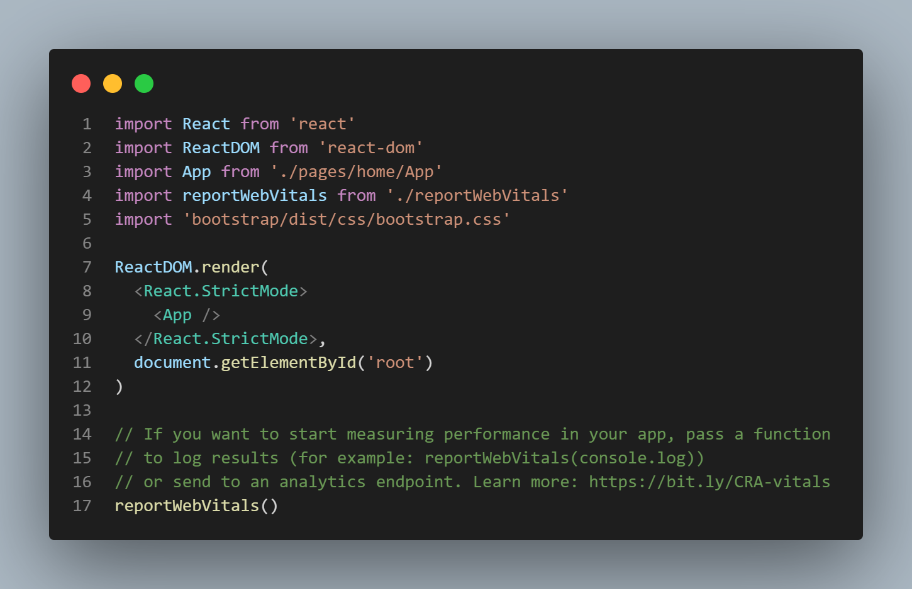
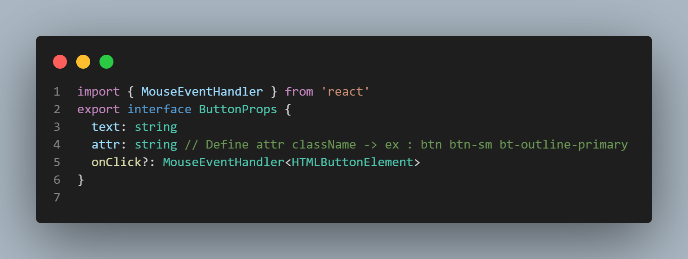
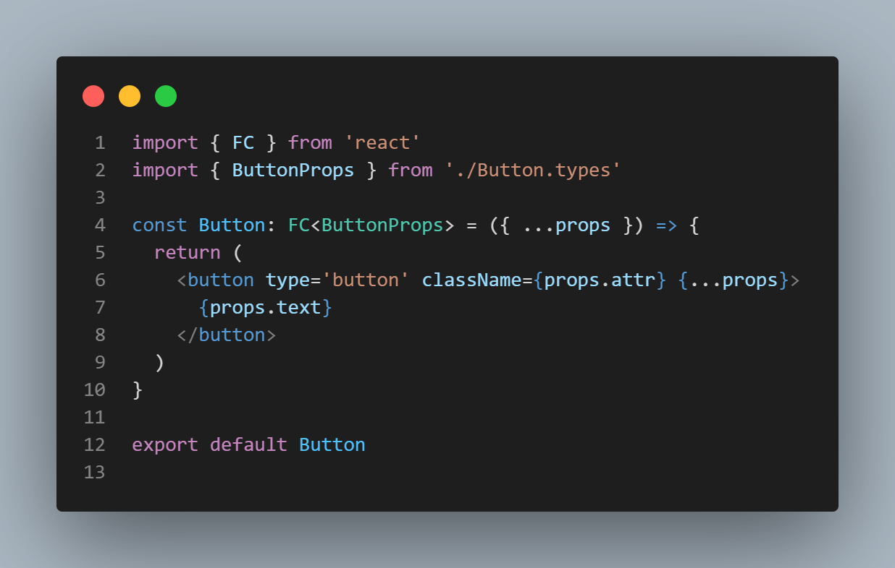

# Branche : Layout pattern

## Design de l'application


Le visuel ci-dessus représente notre page d'accueil de blog minimaliste. L'objectif de cette branche est de vous guider étape par étape de toute la décomposition de la structure sous forme de composants.

## 1 - Décomposition de la structure pour notre layout


Cette étape sucite à détecter tous les composants primaires qui seront susceptibles d'accueillir de nouveaux composants.

Pour cette application nous avons recenser 3 composants primaires qui constitueront notre layout :

- Header
- Section
- Footer

> Si le design de votre application est différente, cette idée de décomposition pourra grandement vous aider.

## 2 - Décomposition des composants en profondeur

### Composant Header


Pour le composant Header viendront se greffer 2 autres composants :

- Brand
- NavLink

### Composant Section


Pour le composant Section viendront se greffer 2 autres composants :

- About
- Blog

Si nous allons plus loin, nous pouvons décortiquer d'avantage plus en profondeur ces 2 nouveaux composants :

### Composant About

Si l'on épluche correctement ce composant, nous nous retrouvons avec une liste de valeurs :

- Un titre
- Un sous-titre
- Une bordure
- Un paragraphe
- Une bordure

Par rapport à ce que nous avons recenser, la première question à se poser est la suivante :

- Est-ce qu'il y a un intérêt à vouloir les mettre sous forme de composants ?

> La réponse est non ! Ces valeurs pourront être nommées comme des **accessoires** que nous verrons dans une prochaine branche.

### Composant Blog

Comme pour le composant About nous nous retrouvons avec une liste de valeurs :

- Un titre
- Un sous-titre
- Une liste de News avec plusieurs autres valeurs distinctent à l'intérieur
- Un bouton rouge

Donc toujours en liaison avec notre liste ci-dessus, ne pas oublier de se poser la même question :

- Est-ce qu'il ya un intérêt à vouloir les mettre sous forme de composants.

Si nous examinons bien le composant blog, on s'aperçoit qu'il ya une duplication de news; et donc nous pouvons effectivement la décliner sous forme de composant.

> Rappel de la fonction d'un composant : Permet de diviser l'interface utilisateur en éléments indépendants et réutilisables.


Pour conclure, nous obtenons de nouveaux 2 composants à rajouter dans notre application :

- BlogItem
- Button

### Composant Footer

N'ayant qu'une seule valeur, ce composant nécessite aucun autre composant.

## Conclusion

Le fait d'éclater notre application sous forme de composants, nous arrivons à un total de 9 composants :

- Header
- Section
- Footer
- Brand
- NavLink
- About
- Blog
- BlogItem
- Button

# Développement

Notre application implémentera le style css de Bootstrap

> Libre à vous de choisir votre Framework css préféré

## Installation de la dépendance Bootstrap

```
> npm i bootstrap
```

ou

```
> yarn add bootstrap
```

## Importation de Bootstrap dans l'application

`/src/index.ts`


## Création des composants

Pour ce didactiel nous allons uniquement créer le composant Button pour que vous puissez avoir un ordre d'idée lors des étapes de conception d'un composant. Et si vous souhaitez avoir tous les composants n'hésitez pas à cloner cette branche.

### Bien comprendre la notion de composant

Si nous prenons l'exemple d'un bouton, avec bootstrap nous l'écrirons de cette manière :

```
<button type="button" class="btn btn-primary">Mon bouton</button>
```

Avec React nous avons la posibilité de pouvoir refactoriser cette balise.

### Ce que nous avons comme arguments :

- La balise button (ouvrante/fermante)
- Le type
- L'attribut class
- Le texte du bouton

### Ce que nous pouvons faire

Nous avons imaginer avoir un rendu de composant de cette manière :

```
<Button attr='btn btn-primary' text='Mon bouton' />
```

Ainsi nous avons réduit la liste des arguments :

- La balise ouvrante uniquement
- L'attribut class qui se transforme attr
- L'attribut text pour le texte du bouton

> Encore une fois ! React vous laisse le choix de pouvoir créer vos composants à votre convenance

### Etape 1 - Création d'une interface "Button"

[Pour plus d'information sur l'interface](https://www.typescriptlang.org/docs/handbook/interfaces.html)

`/src/components/button/Button.types.ts`


**Explication**

- Nous créons une interface appeler ButtonProps
- Cette interface contient un objet de 3 arguments
- - text qui sera de type string et est obligatoire
- - attr qui sera de type string et est obligatoire
- - onClick qui sera un evenement au click est qui est facultatif

### Etape 2 - Création du composant "Button"

`/src/components/button/Button.tsx`


Nous avons terminé pour la création d'un composant **Button**

> N'hésitez pas à vous exercer lors de la création de vos composants.

> N'hésitez pas à cloner la branche pour mieux comprendre l'architecture
