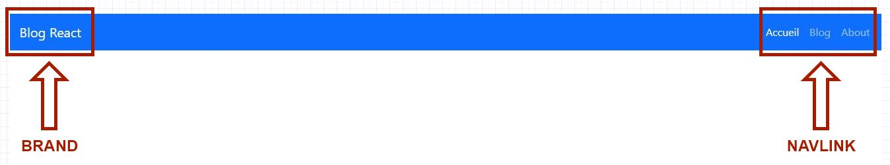

# Branche : Layout pattern

## Design de l'application

Le visuel ci-dessus représente notre page d'accueil de blog minimaliste. L'objectif de cette branche est de vous guider étape par étape de toute la décomposition de la structure sous forme de composants.

## 1 - Décomposition de la structure pour notre layout

Cette étape sucite à détecter tous les composants primaires qui seront susceptibles d'accueillir de nouveaux composants.

Pour cette application nous avons recenser 3 composants primaires qui constitueront notre layout :

- Header
- Section
- Footer

> Si le design de votre application est différente, cette idée de décomposition pourra grandement vous aider.

## 2 - Décomposition des composants en profondeur

### Composant Header

Pour le composant Header viendront se greffer 2 autres composants :

- Brand
- NavLink

### Composant Section

Pour le composant Section viendront se greffer 2 autres composants :

- About
- Blog

Si nous allons plus, nous pouvons décortiquer d'avantage plus en profondeur ces 2 nouveaux composants :

### Composant About

Si l'on épluche correctement ce composant, nous nous retrouvons avec une liste de valeurs :

- Un titre
- Un sous-titre
- Une bordure
- Un paragraphe
- Une bordure

Par rapport à ce que nous avons recenser, la première question à se poser est la suivante :

- Est-ce qu'il y a un intérêt à vouloir les mettre sous forme de composants ?

> La réponse est non ! Ces valeurs pourront être nommées comme des **accessoires** que nous verrons dans une prochaine branche.

### Composant Blog

Comme pour le composant About nous nous retrouvons avec une liste de valeurs :

- Un titre
- Un sous-titre
- Une liste de News avec plusieurs autres valeurs distinctent à l'intérieur
- Un bouton rouge

Donc toujours en liaison avec notre liste ci-dessus, ne pas oublier de se poser la même question :

- Est-ce qu'il ya un intérêt à vouloir les mettre sous forme de composants.

Si nous examinons bien le composant blog, on s'aperçoit qu'il ya une duplication de news; et donc nous pouvons effectivement la décliner sous forme de composant.

> Rappel de la fonction d'un composant : Permet de diviser l'interface utilisateur en éléments indépendants et réutilisables.

Pour conclure, nous obtenons de nouveaux 2 composants a rajouter dans notre application :

- BlogItem
- Button

### Composant Footer

N'ayant qu'une seule valeur, ce composant nécessite aucun autre composant.

## Conclusion

Le fait d'éclater notre application sous forme de composant, nous arrivons à un total de 9 composants :

- Header
- Section
- Footer
- Brand
- NavLink
- About
- Blog
- BlogItem
- Button
