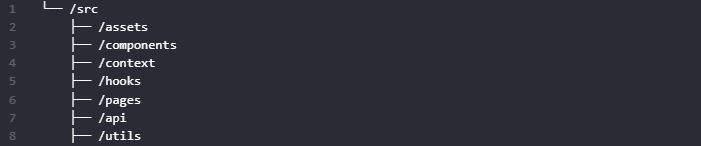

# Branche : Architecture pattern

## Organisation des dossiers et fichiers du projet

Bien que React nous laisse libre choix d'organiser et de structurer un projet. L'architecture que nous proposons permet de maintenir un cycle de vie d'une application React sain et bien organisé de sorte à ce qu'un développeur ou une équipe de développeur travaille dans de meilleurs conditions.

Lorsque vous développez une page dans une application React, pensez à la diviser en éléments modulaires. Cela vous aidera à réduire la complexité et à créer des structures ouvertes pour être réutilisables ou partagées dans l'ensemble de l'application.

### Arborescence :

## Dossier **assets**

Ce dossier contiendra des images de notre application

## Dossier **components**

Ce dossier contiendra tout une liste de composants réutilisables :

- Composant Header
- Composant Navbar
- Composant Footer
- Composant Button
- Composant Filter
- ...

## Dossier **context**

Habituellement, vous passerez des informations d'un composant parent à un composant enfant via des accessoires. Mais passer des accessoires peut devenir verbeux et peu pratique si vous devez les passer à travers de nombreux composants au milieu, ou si de nombreux composants de votre application ont besoin des mêmes informations. Le contexte permet au composant parent de mettre des informations à la disposition de n'importe quel composant de l'arborescence en dessous, quelle que soit sa profondeur, sans les transmettre explicitement via les props.

La solution serait d'utiliser dans ce dossier, soit :

- [React context](https://fr.reactjs.org/docs/context.html)
- [Redux](https://redux.js.org/)
- [Recoil](https://recoiljs.org/fr/)

## Dossier **hooks**

Un crochet React réutilisable est comme une pièce de travail réutilisable. Tout comme vous créez des composants personnalisés, la création d'un hook personnalisé peut aider à réduire la complexité du code.

> Ex de hook : La bascule d'un mot de passe visible ou pas suite à un clic sur une icône (afficher/masquer)

Ce hook sera donc réutilisable dans le cas ou ce champ est visible dans différentes pages.

[Pour plus d'infos ](https://blog.openreplay.com/react-architecture-patterns-for-your-projects)

## Dossier **pages**

Ce dossier contiendra tous les fichiers dédiés à l'interface utilisateur

## Dossier **utils**

Un répertoire facultatif, il peut contenir des constantes et des méthodes d'assistance à l'échelle de l'application. Par exemple, plusieurs composants d'interface utilisateur dans votre application peuvent nécessiter une logique de validation. Séparer cette logique métier de validation dans son propre fichier dans le dossier **/utils** cela vous aidera à créer des flux séparés.

## Dossier **api**

Servira de pont entre l'application et les données externes de l'application
